# Serverless Image Optimization & Analysis

Serverless Image Optimization & Analysis is an AWS serverless platform for authenticated image uploads, configurable optimization, and image analysis. Users select an output format, quality, and maximum dimension, then receive an optimized image together with Rekognition labels and an Amazon Nova 2 Lite description through Amazon Bedrock. The workflow is event-driven and uses AWS managed services without a continuously running server.
## Key Features

- Amazon Cognito sign-up, email verification, sign-in, session persistence, and logout
- Cognito JWT-protected API Gateway HTTP API
- Presigned S3 uploads, keeping image binaries out of API Gateway
- User-controlled JPEG, PNG, or WebP output format
- Quality control and maximum-dimension resizing
- Separate source and destination S3 buckets
- S3 event notification to SQS
- SQS dead-letter queue (DLQ) and retry redrive policy
- Python AWS Lambda image processing
- Pillow resizing, compression, and format conversion
- Amazon Rekognition label detection with confidence scores
- Amazon Bedrock Converse with Amazon Nova 2 Lite for image descriptions
- DynamoDB persistence for processing metadata and analysis results
- Dashboard, upload, gallery/history, and image details views
- Temporary image URLs for viewing and downloading processed images
- Image deletion from source S3, destination S3, and DynamoDB
- Terraform infrastructure as code
- Lambda and application logging through Amazon CloudWatch

## Architecture

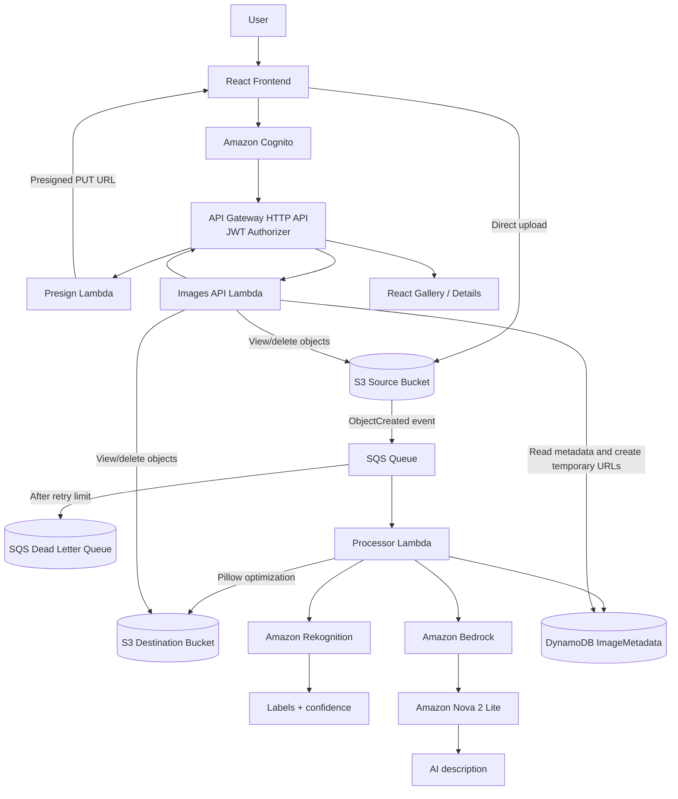

The browser authenticates with Cognito, obtains a JWT, and uses the protected API only for presigning, metadata retrieval, and deletion. Image bytes are uploaded directly to S3. S3 places an event in SQS, and the Processor Lambda asynchronously optimizes and analyzes the image before storing the result in DynamoDB.

## How It Works

1. A user signs up or signs in with Amazon Cognito.
2. The React frontend obtains an authenticated session and JWT.
3. The frontend requests a presigned upload URL from `POST /presign`.
4. Presign Lambda validates the requested output format, quality, and maximum dimension, then signs the S3 upload request with those settings as object metadata.
5. The browser uploads the original image directly to the S3 source bucket.
6. S3 emits an object-created event to the SQS processing queue.
7. Processor Lambda consumes the SQS message.
8. The processor reads the uploaded image and its optimization metadata from S3.
9. Pillow resizes and encodes the image using the selected format, quality, and maximum dimension.
10. The optimized image is written to the destination S3 bucket.
11. Amazon Rekognition detects labels and returns confidence scores.
12. Amazon Bedrock sends the optimized image bytes to Amazon Nova 2 Lite, which generates a concise factual description.
13. The processor stores optimization and analysis metadata in DynamoDB with `ProcessingStatus` set to `COMPLETED`.
14. The frontend retrieves records through authenticated `GET /images`.
15. Gallery and Details pages display image comparison, metrics, Rekognition results, and the AI description.
16. Users can download the optimized image or delete the source image, processed image, and metadata through `DELETE /images/{id}`.

## AWS Services Used

| Service | Purpose |
|---|---|
| Amazon Cognito | User registration, email verification, sign-in, and JWT sessions |
| Amazon API Gateway HTTP API | Authenticated `/presign` and `/images` API routes |
| AWS Lambda | Presign, asynchronous processing, and images metadata API |
| Amazon S3 | Source uploads, optimized output, and temporary object access URLs |
| Amazon SQS | Decouples S3 uploads from image processing |
| Amazon SQS DLQ | Receives messages that exceed the queue retry limit |
| Amazon DynamoDB | Stores image metadata, optimization metrics, labels, and AI captions |
| Amazon Rekognition | Detects image labels and confidence scores |
| Amazon Bedrock | Provides the Converse API for Amazon Nova 2 Lite |
| Amazon CloudWatch | Receives Lambda execution logs |
| AWS IAM | Lambda execution permissions and service access policies |
| Terraform | Provisions and manages the AWS infrastructure |

## Image Optimization

The upload page lets the user choose:

- Output format: JPEG, PNG, or WebP
- Quality value
- Maximum image dimension

The Processor Lambda reads these settings from S3 object metadata and uses Pillow to perform the server-side transformation. The implementation preserves the image aspect ratio and limits the maximum dimension; it does not claim that every input will become smaller.

For each completed image, the application records:

- Original size
- Optimized size
- Bytes saved
- Percentage reduction
- Output format
- Quality
- Maximum dimension

JPEG and JPG are normalized internally as `jpeg`. The resulting destination object uses the matching extension and MIME type.

## AI Image Analysis

### Amazon Rekognition

Rekognition detects visual labels in the optimized image and returns each label with a confidence score. WebP input is converted in memory when necessary for Rekognition compatibility; no temporary Rekognition-only image is uploaded.

### Amazon Bedrock and Amazon Nova 2 Lite

The Processor Lambda uses Amazon Bedrock Converse with Amazon Nova 2 Lite:

```text
global.amazon.nova-2-lite-v1:0
```

Nova receives the actual optimized image bytes and a prompt requesting one concise, factual description. The generated text is stored in DynamoDB as `AiCaption` during processing. If the Bedrock call fails, the exception is logged and the optimization, Rekognition, and metadata pipeline remains available without inventing a caption.

## Event-Driven Processing

The processing path is:

```text
S3 Source Bucket → SQS Queue → Processor Lambda
```

SQS decouples the user-facing upload request from asynchronous image processing. The queue provides retry behavior through its redrive policy, and messages that exceed the configured receive limit are sent to the DLQ for investigation rather than being retried indefinitely.

## DynamoDB Metadata

The `ImageMetadata` table uses `ImageId` as its partition key. Processor records include:

| Field | Description |
|---|---|
| `ImageId` | Identifier derived from the uploaded object key |
| `OriginalFileName` | Source object key |
| `ProcessedFileName` | Destination optimized object key |
| `SourceBucket` | Source S3 bucket |
| `DestinationBucket` | Destination S3 bucket |
| `OriginalSize` | Original image size in bytes |
| `OptimizedSize` | Optimized image size in bytes |
| `SizeReductionPercent` | Calculated percentage reduction |
| `OutputFormat` | Actual output format |
| `Quality` | Requested optimization quality |
| `MaxDimension` | Requested maximum dimension |
| `RekognitionLabels` | Label names and confidence values |
| `AiCaption` | Amazon Nova 2 Lite description |
| `ProcessingStatus` | Current processing state, including `COMPLETED` |
| `UploadTimestamp` | Processing record timestamp |

The Images API scans the table for the authenticated application flow, adds temporary S3 URLs for available source and processed objects, and supports deletion of the related S3 objects and DynamoDB item.

## Frontend

The React/Vite frontend contains:

- **Login**: Cognito sign-in, account creation, and email verification
- **Dashboard**: Processing totals, optimization metrics, and recent image records
- **Upload**: Image selection, output settings, progress, and separate upload/processing states
- **Gallery**: Search, status filtering, optimization metrics, labels, AI descriptions, downloads, and deletion
- **Details**: Original/optimized comparison, sizes, saved bytes, reduction percentage, output settings, status, labels, confidence scores, AI description, and upload timestamp

The frontend communicates with API Gateway using an `Authorization` header containing the Cognito JWT. It does not contain AWS access keys and does not call Rekognition, Bedrock, DynamoDB, or SQS directly.

## API Routes

The deployed HTTP API exposes these authenticated routes:

| Method | Route | Purpose |
|---|---|---|
| `POST` | `/presign` | Generate a presigned S3 upload URL |
| `GET` | `/images` | Retrieve image metadata and temporary image URLs |
| `DELETE` | `/images/{id}` | Delete source object, processed object, and metadata |

The frontend sends upload settings as query parameters to `/presign`:

```text
/presign?file_name=<name>&output_format=<jpeg|png|webp>&quality=<1-100>&max_dimension=<positive integer>
```

## Infrastructure as Code

Terraform configuration is located in [`backend/terraform/`](backend/terraform/). The configuration manages the S3 buckets, S3 notification, SQS queue and DLQ, DynamoDB table, Cognito pool and client, IAM permissions, Lambda functions, API Gateway HTTP API, JWT authorizer, routes, and Lambda event source mapping used by the application.

The configured AWS region is `ap-south-1`.

### Terraform Commands

Run Terraform from the infrastructure directory:

```powershell
cd backend/terraform
terraform init
terraform plan
terraform apply
```

The AWS provider configuration uses the standard AWS credential chain and the configured `eventdrivenimageapp` profile. Provide credentials through your local AWS configuration or environment; never add credentials to the repository.

To remove infrastructure in a personal test account, use the normal Terraform workflow only after reviewing the plan:

```powershell
cd backend/terraform
terraform destroy
```

## Local Development

### Frontend

The frontend requires Node.js and npm:

```powershell
cd frontend
npm install
npm run dev
```

The Vite development server runs on the configured local port, normally `http://localhost:5173`.

Create a local environment file from the provided example and set the deployed API and Cognito values for your environment:

```text
VITE_API_BASE_URL=<API Gateway base URL>
VITE_COGNITO_USER_POOL_ID=<Cognito user pool ID>
VITE_COGNITO_CLIENT_ID=<Cognito app client ID>
VITE_AWS_REGION=ap-south-1
```

The frontend uses `amazon-cognito-identity-js` for browser authentication and stores no AWS access keys.

### Backend Lambda Code

The Lambda source is organized under [`backend/lambdas/`](backend/lambdas/):

- `presign/` contains the presigned S3 upload URL handler.
- `processor/` contains the SQS-triggered processor, Pillow optimizer, and Rekognition/Bedrock analyzer.
- `images_api/` contains the metadata retrieval and deletion handler.

The Processor Lambda package includes Pillow and is archived by Terraform from its source directory. The presign and Images API dependency files are kept with their respective Lambda folders.

## Verified End-to-End Flow

The implemented flow has been exercised through the application UI and AWS services:

```text
React UI
→ Amazon Cognito
→ API Gateway HTTP API
→ Presign Lambda
→ S3 source upload
→ SQS
→ Processor Lambda
→ Pillow optimization
→ S3 optimized output
→ Rekognition labels/confidence
→ Bedrock / Amazon Nova 2 Lite
→ DynamoDB metadata
→ Gallery and Details UI
```

The repository assets include evidence of authentication, upload, S3 objects, SQS/Lambda processing, CloudWatch completion logs, DynamoDB metadata, Terraform infrastructure, and the frontend results screens.

## Screenshots

### Authentication and Application

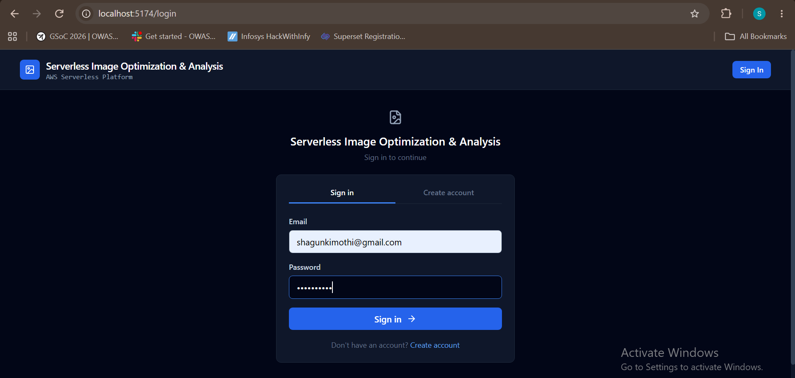

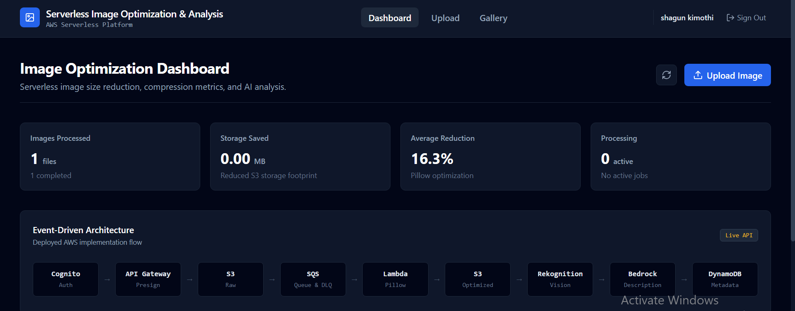

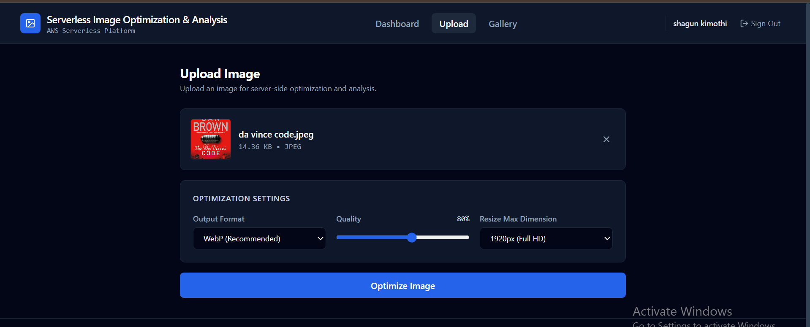

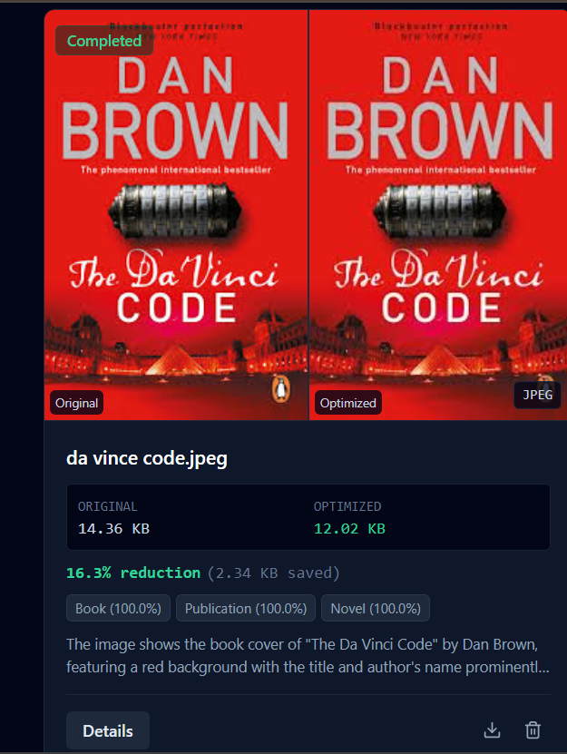

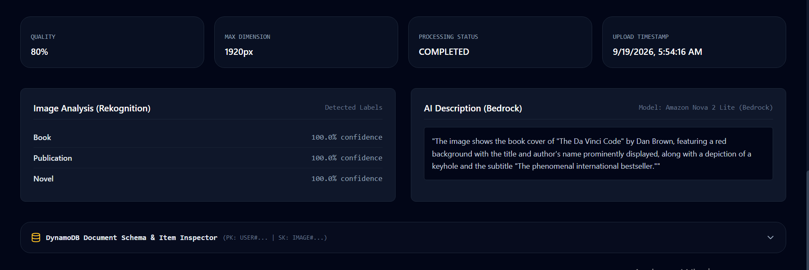

### AWS Infrastructure and Processing

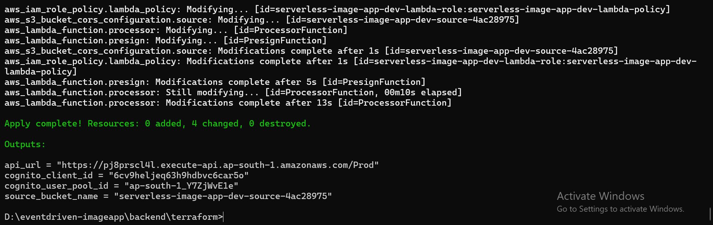

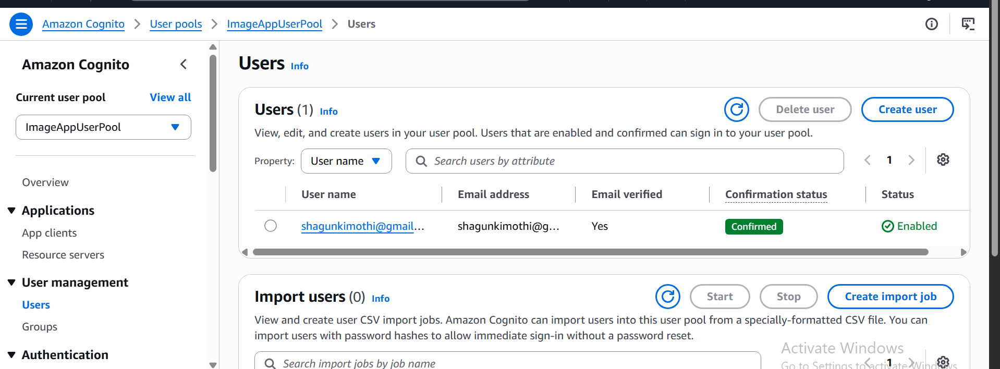

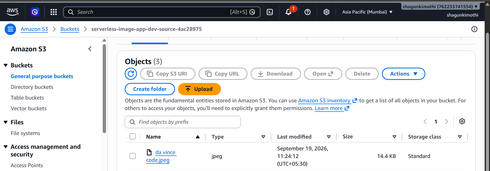

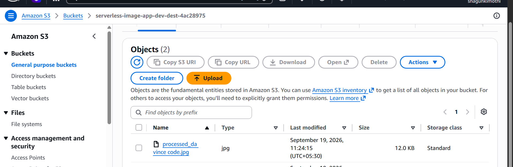

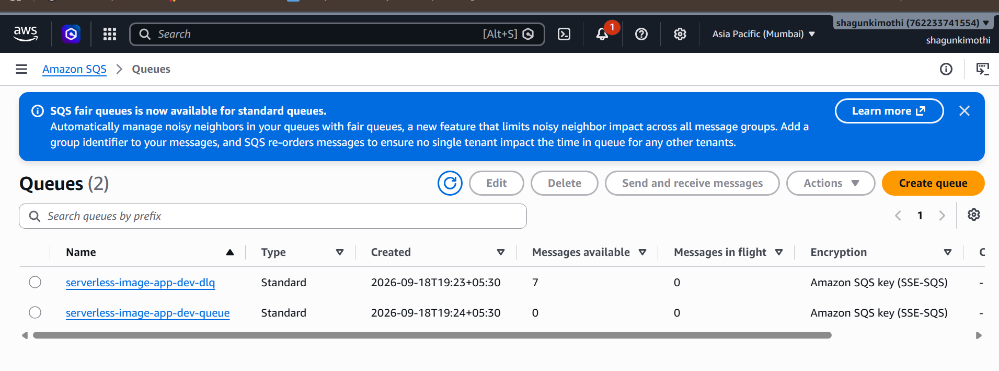

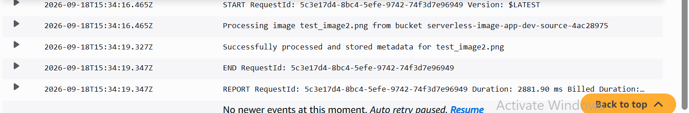

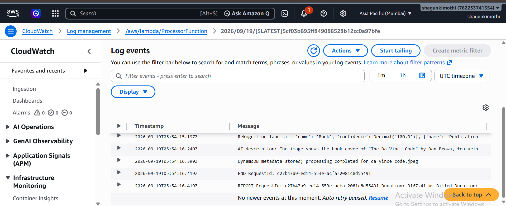

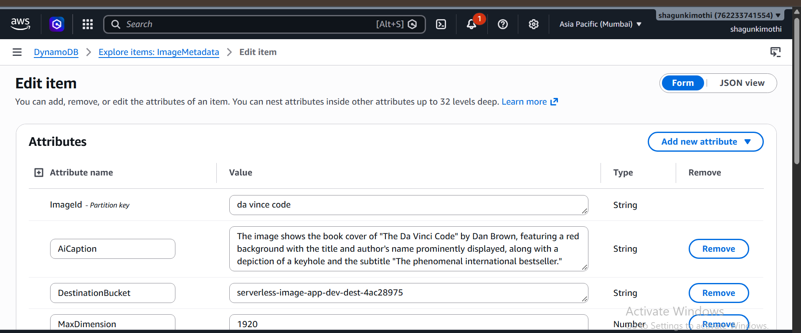

Additional related screenshots are available in [`assets/`](assets/), including alternate S3, SQS, DynamoDB, and test views.

## Project Structure

```text
eventdrivenimageapp/
├── backend/
│   ├── lambdas/
│   │   ├── images_api/
│   │   │   ├── app.py
│   │   │   └── requirements.txt
│   │   ├── presign/
│   │   │   ├── app.py
│   │   │   └── requirements.txt
│   │   └── processor/
│   │       ├── analyzer.py
│   │       ├── app.py
│   │       ├── optimizer.py
│   │       └── requirements.txt
│   └── terraform/
│       ├── main.tf
│       ├── outputs.tf
│       ├── providers.tf
│       ├── variables.tf
│       └── versions.tf
├── frontend/
│   ├── src/
│   │   ├── components/
│   │   ├── config/
│   │   ├── context/
│   │   ├── pages/
│   │   └── services/
│   ├── package.json
│   └── vite.config.js
├── assets/
└── README.md
```

## Security and Reliability

- Amazon Cognito provides user authentication and email verification.
- API Gateway routes use a Cognito JWT authorizer.
- Lambda functions use an IAM execution role for S3, SQS, DynamoDB, Rekognition, Bedrock, and CloudWatch operations required by the current implementation.
- Presigned S3 URLs allow direct browser uploads without exposing AWS credentials.
- The frontend contains no AWS access keys or secret keys.
- S3, SQS, Lambda, and DynamoDB operations are logged or represented through Lambda execution logs and processing status.
- SQS retries failed deliveries and routes messages to the configured DLQ after the receive limit.
- The current Images API reads the table and does not implement a separate per-user ownership filter in DynamoDB; authentication protects the API routes, but backend user-level data isolation should not be inferred from the current implementation.

## Future Improvements

These are future work, not current features:

- Stronger per-user authorization and ownership filtering in the metadata layer
- CloudFront distribution for optimized image delivery
- CloudWatch alarms and application-level operational dashboards
- Remote Terraform state and collaborative state management
- GitHub Actions CI/CD with AWS OIDC

## Project

**B.Tech Computer Science — Cloud Computing & Virtualization**

GitHub: [shagunkimothi/eventdriven-imageapp](https://github.com/shagunkimothi/eventdriven-imageapp)
