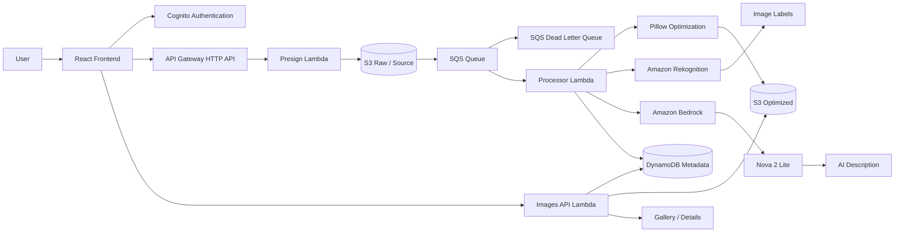

# Serverless Image Optimization & Analysis

This project is a serverless AWS application for authenticated image upload, optimization, analysis, and metadata management. Users upload images through a React frontend, authenticate with Amazon Cognito, and access protected APIs through API Gateway. The system processes images asynchronously through S3, SQS, and Lambda, optimizes them with Pillow, analyzes them with Amazon Rekognition, generates an AI description with Amazon Bedrock Nova 2 Lite, and stores the metadata in DynamoDB for display in the gallery and image details pages.

The application is designed around an event-driven serverless architecture and is managed with Terraform and GitHub Actions.

## Key Features

- Cognito user authentication
- API Gateway HTTP API with JWT authorization
- Secure presigned S3 uploads
- Unique, user-associated image processing flow
- S3 event-driven processing
- SQS queue and SQS dead-letter queue
- Lambda-based asynchronous image processing
- Pillow-based image optimization
- Image resizing and compression
- WebP/JPEG/PNG output support where implemented
- Original vs optimized file size comparison
- Percentage reduction reporting
- Amazon Rekognition label detection
- Amazon Bedrock Nova 2 Lite image description
- DynamoDB metadata persistence
- Gallery and image details UI
- CloudWatch logging
- Terraform Infrastructure as Code
- GitHub Actions CI/CD
- GitHub OIDC authentication
- Remote Terraform state in Amazon S3

## Architecture



The synchronous upload path uses Cognito-authenticated presign requests to generate temporary S3 upload URLs. The asynchronous processing path starts when S3 emits an event to SQS and the Processor Lambda optimizes and analyzes the image. The AI analysis path uses Rekognition for labels and Bedrock with Amazon Nova 2 Lite for a concise natural-language description. The metadata retrieval path reads image records from DynamoDB and returns temporary URLs to the frontend for gallery and details views.

## How the Application Works

1. User signs in through Cognito.
2. Frontend requests a presigned upload URL through API Gateway.
3. Presign Lambda generates the S3 upload URL.
4. Image is uploaded directly to the source S3 bucket.
5. S3 sends an event to SQS.
6. Processor Lambda consumes the SQS message.
7. Pillow optimizes and resizes the image.
8. Optimized image is stored in the destination S3 bucket.
9. Rekognition detects image labels and confidence scores.
10. Bedrock Nova 2 Lite generates a concise image description.
11. Metadata, optimization statistics, labels, and AI description are stored in DynamoDB.
12. Images API Lambda retrieves metadata for the frontend.
13. Gallery and Details pages display the result.

## AWS Services

| Service | Purpose |
|---|---|
| Amazon Cognito | User authentication and session management |
| Amazon API Gateway | HTTPS API routes for presign and metadata access |
| AWS Lambda | Serverless event processing and API handlers |
| Amazon S3 | Raw upload storage and optimized image output |
| Amazon SQS | Queue for asynchronous image processing |
| Amazon DynamoDB | Persistent image metadata and analysis results |
| Amazon Rekognition | Label detection for uploaded images |
| Amazon Bedrock | AI image description generation |
| Amazon CloudWatch | Lambda and application logging |
| IAM | Access control for AWS service integrations |

Model:
Amazon Nova 2 Lite

Model/inference profile ID used by the application:
`global.amazon.nova-2-lite-v1:0`

## Image Optimization

Pillow performs the actual image optimization. The processor reads the upload metadata, applies the requested output format, quality, and max-dimension constraints, and writes the optimized image to the destination bucket.

The implemented behavior includes:

- format normalization for supported image types
- resizing and thumbnail-style scaling where implemented
- JPEG and WebP optimization
- compression based on requested quality values
- original and optimized file size comparison
- percentage reduction calculation
- output format metadata tracking

The application records both original and optimized sizes so that the frontend can show savings and reduction percentages.

## AI Image Analysis

### Amazon Rekognition

Amazon Rekognition analyzes the optimized image and returns labels with confidence scores. These values are stored in DynamoDB and displayed in the image details view.

### Amazon Bedrock

Amazon Bedrock uses the Amazon Nova 2 Lite model to receive the optimized image and generate a concise natural-language description. The generated caption is persisted alongside the metadata for display in the gallery and details pages.

Important: Gemini/Antigravity was used as development assistance only and is not part of the runtime architecture or AWS runtime dependency of this application.

## Security

The current security model includes:

- Cognito authentication for user access
- API Gateway JWT authorization for protected routes
- Presigned S3 upload URLs for direct browser uploads
- IAM roles and policies scoped to the application resources
- Separate AWS resources for the application infrastructure
- GitHub Actions using OIDC instead of long-lived AWS access keys
- GitHub OIDC trust restricted to this repository and the `main` branch
- S3 public access blocking where configured
- Encrypted Terraform state storage with versioning enabled

## Infrastructure as Code

Terraform is used to provision and manage the AWS infrastructure for this project. The Terraform configuration is located under `backend/terraform/` and is version-controlled as part of the repository.

Terraform is used to:

- manage S3 resources and event wiring
- create and configure the SQS queue and DLQ
- define Lambda packaging and permissions
- provision the DynamoDB metadata table
- configure Cognito authentication resources
- create API Gateway routes and authorization
- manage the infrastructure consistently across environments

Remote Terraform state is stored in Amazon S3. The state bucket uses versioning and server-side encryption, and S3 lockfile-based state locking is enabled for safe collaborative infrastructure updates.

## CI/CD

The repository includes a GitHub Actions workflow in `.github/workflows/deploy.yml`.

The workflow performs the following:

- triggers on pushes to `main`
- supports manual `workflow_dispatch`
- checks out the repository
- sets up Node.js
- installs frontend dependencies
- runs the frontend build
- validates Python Lambda syntax
- runs `terraform fmt -check`
- runs `terraform init` with the remote S3 backend
- runs `terraform validate`
- runs `terraform plan`
- runs `terraform apply` only after validation succeeds

The deployment flow authenticates to AWS using GitHub OIDC and does not store long-lived AWS access keys in GitHub. The workflow is configured to assume a dedicated AWS IAM deployment role through the repository's OIDC trust configuration.

## Project Structure

```text
eventdriven-imageapp/
├── backend/
│   ├── lambdas/
│   │   ├── images_api/
│   │   │   ├── app.py
│   │   │   └── requirements.txt
│   │   ├── presign/
│   │   │   ├── app.py
│   │   │   └── requirements.txt
│   │   └── processor/
│   │       ├── analyzer.py
│   │       ├── app.py
│   │       ├── optimizer.py
│   │       └── requirements.txt
│   ├── terraform/
│   │   ├── backend.tf
│   │   ├── main.tf
│   │   ├── outputs.tf
│   │   ├── providers.tf
│   │   ├── variables.tf
│   │   └── versions.tf
│   └── template.yaml
├── frontend/
├── assets/
├── .github/
│   ├── oidc-permissions-policy.json
│   ├── oidc-trust-policy.json
│   └── workflows/
│       └── deploy.yml
├── .gitignore
├── README.md
└── github-trust-policy.json
```

## Local Development

### Frontend

```bash
cd frontend
npm install
npm run dev
```

### Terraform

```bash
cd backend/terraform
terraform init
terraform validate
terraform plan
terraform apply
```

### Lambda code

The Lambda source is organized under `backend/lambdas/`:

- `presign/` contains the presigned URL generation logic
- `processor/` contains the SQS-triggered optimizer and analyzer
- `images_api/` contains metadata retrieval and deletion logic

## Verified Implementation

The following flow is part of the implemented and validated project:

1. Authentication
2. Presigned upload
3. S3 source upload
4. S3 → SQS event flow
5. Processor Lambda execution
6. Pillow optimization
7. Optimized S3 output
8. DynamoDB metadata
9. Rekognition labels
10. Bedrock Nova 2 Lite description
11. Gallery/Details display
12. Terraform infrastructure management
13. GitHub Actions CI/CD

## Screenshots

### Authentication


### Dashboard


### Upload


### Gallery with AI Analysis


### Image Details


### Terraform Infrastructure


### S3 Source Upload


### Optimized S3 Output


### SQS / Lambda


### CloudWatch


### DynamoDB


## Technology Stack

Frontend:
- React
- Vite
- JavaScript
- CSS

Backend:
- Python
- AWS Lambda
- Pillow

AWS:
- Cognito
- API Gateway
- S3
- SQS
- DynamoDB
- Rekognition
- Bedrock
- CloudWatch
- IAM

Infrastructure:
- Terraform

CI/CD:
- GitHub Actions
- GitHub OIDC

## Future Improvements

- CloudFront-based frontend hosting
- stronger least-privilege IAM refinement for CI/CD
- improved image processing presets
- additional image metadata and search capabilities
- monitoring dashboards and alerts
- better automated integration testing

## Final Note

This repository reflects the implemented serverless image optimization and analysis application, along with the associated Terraform infrastructure and GitHub Actions automation. The architecture and tooling documented here correspond to the current project state and do not include fictional product names or non-implemented features.
