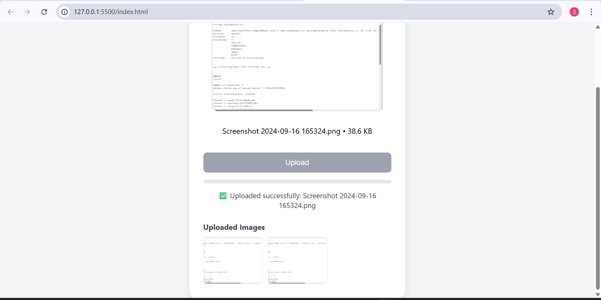
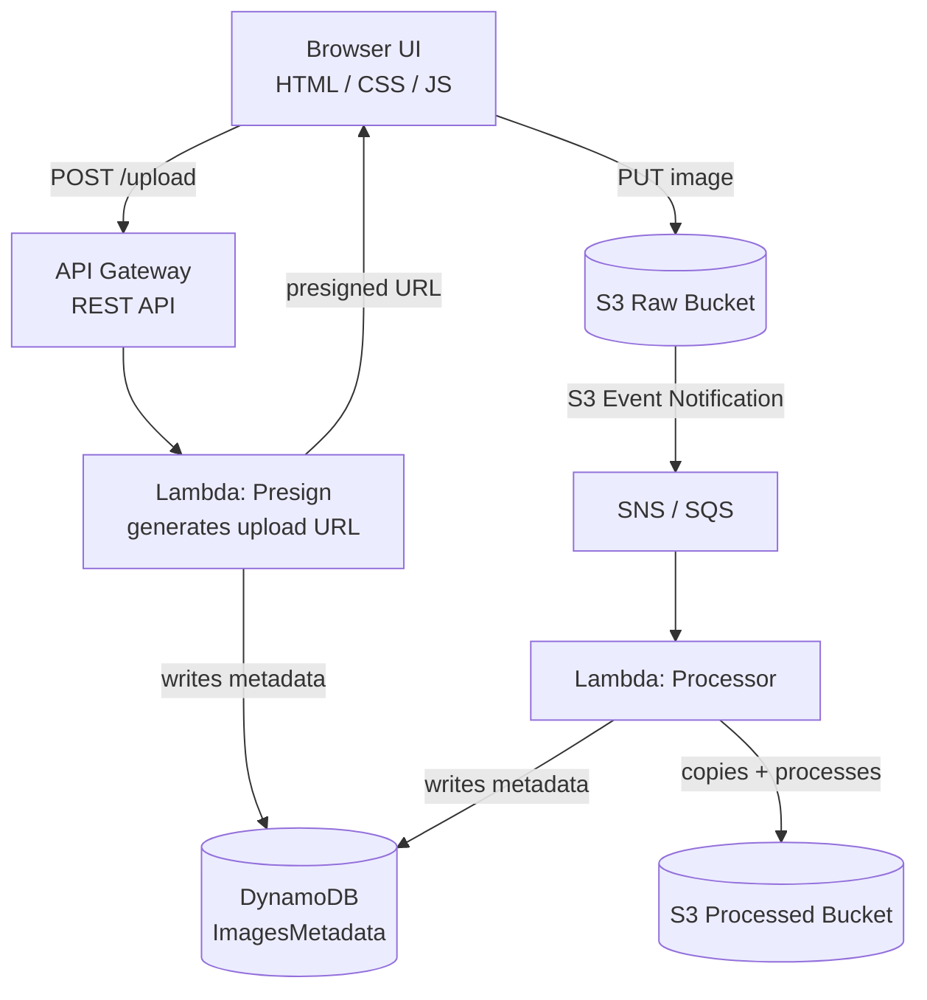
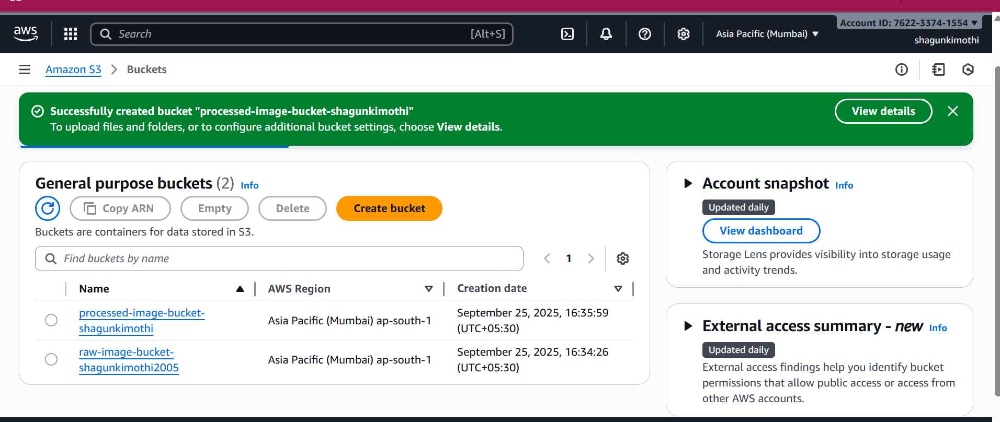
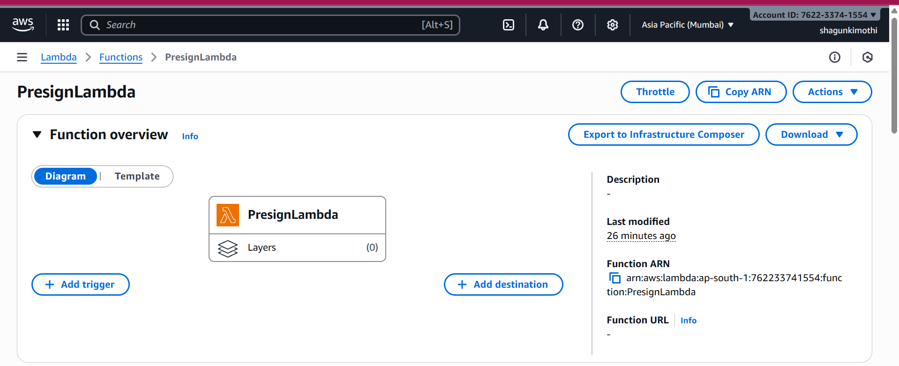
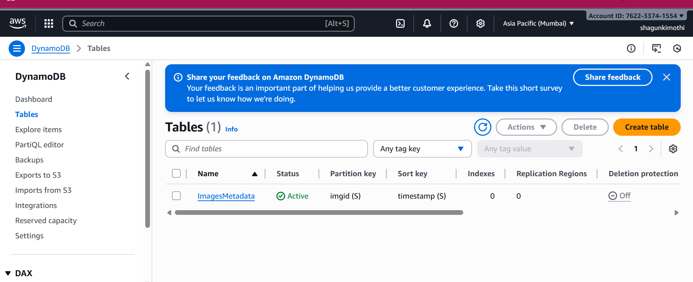
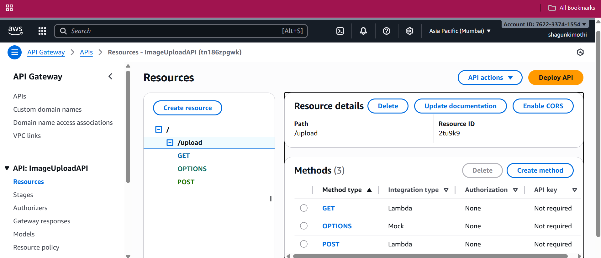
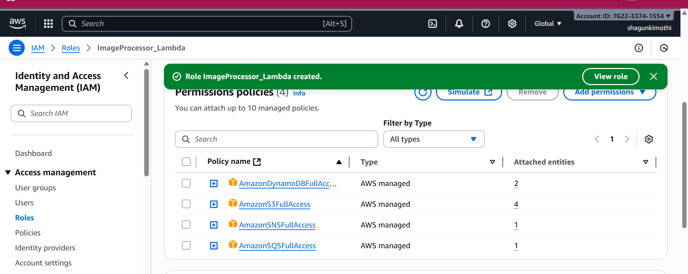
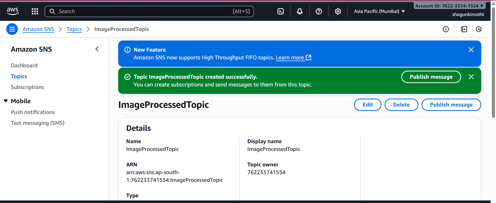

# ☁️ Serverless Event-Driven Image Processing App

A fully serverless image upload and processing pipeline built on AWS. Users upload images through a browser UI; the backend stores them in S3, reacts to the upload event, processes the file through Lambda, and logs metadata in DynamoDB — with zero servers to manage.

<p>
  
  
  
  
  
</p>

<p align="center">
  
</p>

---

## Table of Contents

- [Overview](#overview)
- [Architecture](#architecture)
- [Features](#features)
- [Tech Stack](#tech-stack)
- [Screenshots](#screenshots)
- [AWS Setup & Deployment](#aws-setup--deployment)
- [Project Structure](#project-structure)
- [Current Limitations](#current-limitations)
- [Roadmap](#roadmap)
- [Skills Demonstrated](#skills-demonstrated)
- [Author](#author)

---

## Overview

This project simulates a real-world, production-style media pipeline using only managed AWS services. It was built to practice designing event-driven, serverless architecture end-to-end — from a browser upload flow, through IAM-scoped compute, to durable storage and metadata tracking — without provisioning or managing a single server.

## Architecture



**Flow**
1. User selects/drags an image into the web UI.
2. The frontend calls **API Gateway**, which invokes the **Presign Lambda**.
3. The Lambda generates a presigned S3 URL and writes an initial metadata record to **DynamoDB**.
4. The browser uploads the file directly to the **S3 raw bucket** using the presigned URL (no file data passes through Lambda).
5. The upload triggers an **S3 event notification**, published through **SNS/SQS**.
6. The **Processor Lambda** consumes the event, copies the image to the **S3 processed bucket**, and updates its metadata record.
7. The gallery renders processed images fetched via DynamoDB metadata.

## Features

- ✅ Drag-and-drop + click-to-browse upload UI with live preview
- ✅ Direct-to-S3 uploads via presigned URLs (no binary payloads through Lambda/API Gateway)
- ✅ Upload progress bar and status feedback
- ✅ Event-driven processing decoupled from the upload path via SNS/SQS
- ✅ Per-image metadata (ID, timestamp, owner, URL) tracked in DynamoDB with GSIs
- ✅ In-browser gallery of uploaded images
- ✅ IAM least-privilege roles scoped per Lambda function

## Tech Stack

| Layer | Technology |
|---|---|
| Frontend | HTML5, CSS3, Vanilla JavaScript |
| Compute | AWS Lambda (Python) |
| API | Amazon API Gateway (REST) |
| Storage | Amazon S3 (raw + processed buckets) |
| Database | Amazon DynamoDB |
| Messaging | Amazon SNS / SQS |
| Security | AWS IAM (least-privilege roles & policies) |
| Testing | Postman |

## Screenshots

<table>
<tr>
<td width="50%">
<br>
<sub><b>Amazon S3</b> — raw & processed image buckets</sub>
</td>
<td width="50%">
<br>
<sub><b>AWS Lambda</b> — presign function</sub>
</td>
</tr>
<tr>
<td width="50%">
<br>
<sub><b>DynamoDB</b> — image metadata table</sub>
</td>
<td width="50%">
<br>
<sub><b>API Gateway</b> — /upload resource & methods</sub>
</td>
</tr>
<tr>
<td width="50%">
<br>
<sub><b>IAM</b> — least-privilege execution role</sub>
</td>
<td width="50%">
<br>
<sub><b>SNS</b> — image-processed event topic</sub>
</td>
</tr>
</table>

## AWS Setup & Deployment

This project was provisioned directly through the AWS Console (no IaC yet — see [Roadmap](#roadmap)).

**1. S3 — two buckets**
- `raw-image-bucket-*` — original uploads
- `processed-image-bucket-*` — processed output
- CORS enabled for the frontend origin; event notifications wired to SNS/SQS

**2. IAM — least-privilege roles**
- One role per Lambda, scoped to only the services it touches (S3, DynamoDB, SNS/SQS)

**3. Lambda — Presign function**

```python
import json, boto3, os, time, uuid

s3 = boto3.client('s3')
BUCKET = os.environ.get("RAW_BUCKET", "raw-image-bucket")

dynamodb = boto3.resource('dynamodb')
table = dynamodb.Table(os.environ.get("DDB_TABLE", "ImagesMetadata"))

def lambda_handler(event, context):
    filename = f"upload-{int(time.time())}.jpg"
    imgid = str(uuid.uuid4())
    timestamp = str(int(time.time()))

    url = s3.generate_presigned_url(
        'put_object',
        Params={'Bucket': BUCKET, 'Key': filename, 'ContentType': 'image/jpeg'},
        ExpiresIn=300
    )

    userid = event.get('userid', 'anonymous')

    table.put_item(Item={
        'imgid': imgid,
        'timestamp': timestamp,
        'filename': filename,
        'userid': userid,
        'url': f"https://{BUCKET}.s3.amazonaws.com/{filename}"
    })

    return {
        'statusCode': 200,
        'headers': {"Access-Control-Allow-Origin": "*"},
        'body': json.dumps({"uploadURL": url, "filename": filename, "imgid": imgid})
    }
```

**4. Lambda — Processor function** (triggered by the S3 event via SNS/SQS)

```python
import boto3, os
from datetime import datetime

s3 = boto3.client('s3')
dynamodb = boto3.resource('dynamodb')
table = dynamodb.Table(os.environ['DDB_TABLE'])
PROCESSED_BUCKET = os.environ['PROCESSED_BUCKET']

def lambda_handler(event, context):
    for record in event['Records']:
        source_bucket = record['s3']['bucket']['name']
        object_key = record['s3']['object']['key']

        s3.copy_object(
            Bucket=PROCESSED_BUCKET,
            Key=object_key,
            CopySource={'Bucket': source_bucket, 'Key': object_key}
        )

        table.put_item(Item={
            'imageId': object_key,
            'timestamp': datetime.utcnow().isoformat()
        })

    return {"status": "done"}
```

**5. DynamoDB — `ImagesMetadata` table**

| Attribute | Type | Role |
|---|---|---|
| `imgid` | String | Partition key |
| `timestamp` | String | Sort key |
| `filename` | String | Uploaded file name |
| `userid` | String | GSI: `userindex` |
| `url` | String | GSI: `urlindex` |

**6. API Gateway**
- REST API with a `POST /upload` resource, CORS enabled, integrated with the Presign Lambda

**7. Frontend**
- Static HTML/CSS/JS served locally (or from S3 + CloudFront); calls the API Gateway endpoint with `fetch()` and uploads to S3 with `XMLHttpRequest` for progress tracking

## Project Structure

```
├── index.html              # Upload UI markup
├── style.css               # UI styling
├── script.js                # Drag-and-drop, presigned upload, progress, gallery
├── assets/
│   └── screenshots/         # README images
└── README.md
```

> Lambda functions, IAM roles, and other AWS resources for this project are configured directly in the AWS Console rather than checked into this repo; their source is documented above for reference.

## Current Limitations

- The processing Lambda does not yet transform images (no resize, filter, or watermark) — the processed copy is currently identical to the raw upload
- No authentication — uploads are anonymous
- Infrastructure is provisioned manually via the AWS Console rather than as code

## Roadmap

- [ ] Real image transformations (resize, compress, format conversion) via Pillow
- [ ] Infrastructure as Code (AWS SAM / Terraform)
- [ ] Gallery page backed by DynamoDB queries (list/browse processed images)
- [ ] User authentication via AWS Cognito
- [ ] CloudFront CDN in front of the processed bucket
- [ ] Image deletion support

## Skills Demonstrated

- Designing event-driven, decoupled architectures (S3 → SNS/SQS → Lambda)
- Serverless compute with AWS Lambda (Python) and API Gateway REST APIs
- Secure, direct-to-S3 uploads using presigned URLs
- NoSQL data modeling with DynamoDB partition/sort keys and GSIs
- Least-privilege IAM role design
- Vanilla JS front-end work: drag-and-drop, `fetch`/`XMLHttpRequest`, upload progress UI

## Author

**Shagun Kimothi**
Cloud Computing Project — AWS Serverless Architecture

[](https://github.com/shagunkimothi/eventdriven-imageapp)
